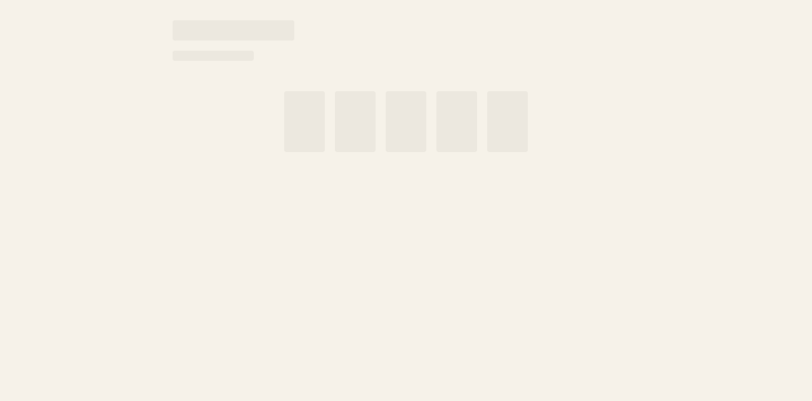
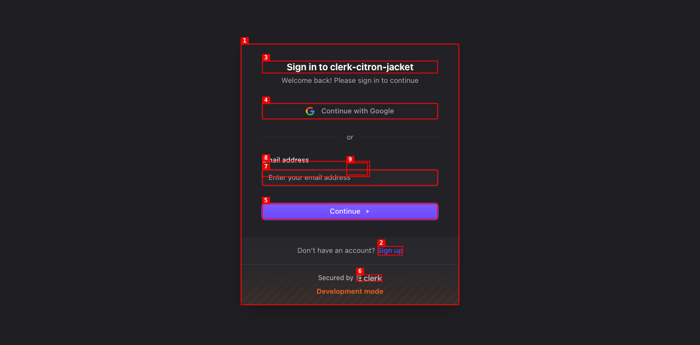
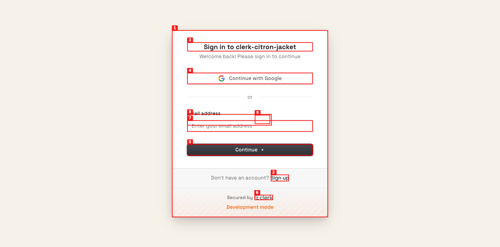
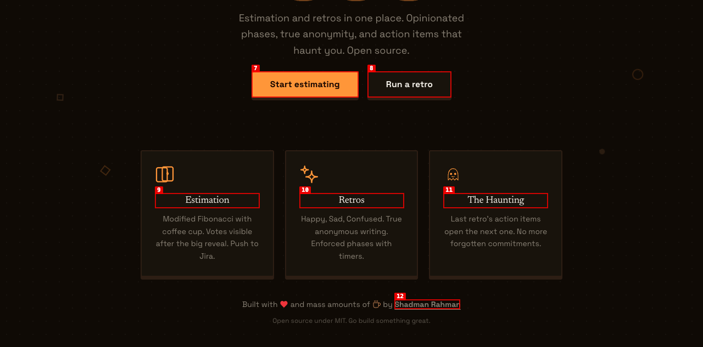
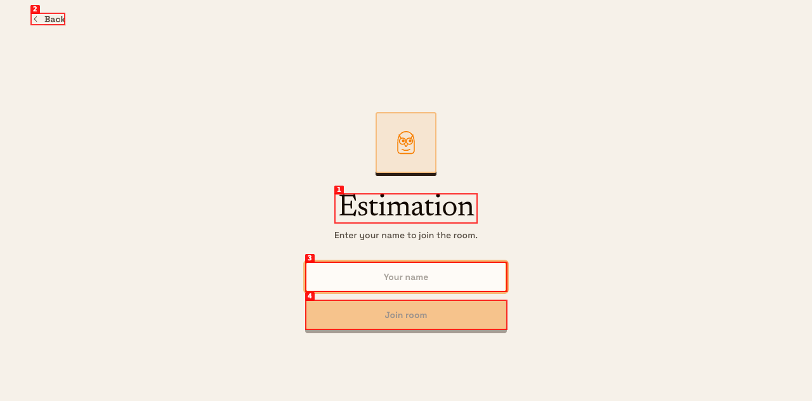

# Dogfood Report: Ceremonies.dev

| Field | Value |
|-------|-------|
| **Date** | 2026-03-20 |
| **App URL** | https://ceremonies.dev |
| **Session** | ceremonies-dev |
| **Scope** | Full app: landing page, auth, estimation room, retro room, dashboard |

## Summary

| Severity | Count |
|----------|-------|
| Critical | 1 |
| High | 0 |
| Medium | 2 |
| Low | 4 |
| **Total** | **7** |

## Issues

### ISSUE-001: Estimation and Retro rooms stuck on loading skeleton (PartyKit WebSocket not connecting)

| Field | Value |
|-------|-------|
| **Severity** | critical |
| **Category** | functional |
| **URL** | https://ceremonies.dev/estimation/demo |
| **Repro Video** | N/A |

**Description**

After joining the estimation room (or retro room), the page shows a loading skeleton indefinitely. The PartyKit production server at `ceremonies.mshadmanrahman.partykit.dev` is unreachable (SSL handshake fails). The `NEXT_PUBLIC_PARTYKIT_HOST` env var was set on Vercel production, but the PartyKit domain may still be provisioning or the deploy hasn't picked up the new env var yet.

**Repro Steps**

1. Navigate to https://ceremonies.dev, click "Start estimating"
   

2. Enter name "Dogfood Tester", click "Join room"

3. **Observe:** Page shows loading skeleton (gray placeholder bars) indefinitely. No room state loads.
   

**Root cause:** `ceremonies.mshadmanrahman.partykit.dev` returns HTTP 000 (SSL fail). Either domain still provisioning or PartyKit deploy incomplete.

**Fix:** Redeploy PartyKit (`npx partykit deploy`) and verify domain resolves. Then trigger a Vercel redeploy to pick up the env var.

---

### ISSUE-002: Sign-in page shows "clerk-citron-jacket" instead of app name "Ceremonies"

| Field | Value |
|-------|-------|
| **Severity** | medium |
| **Category** | content |
| **URL** | https://engaging-monkfish-58.accounts.dev/sign-in |
| **Repro Video** | N/A |

**Description**

The Clerk sign-in page title reads "Sign in to clerk-citron-jacket" instead of "Sign in to Ceremonies". This is the default Clerk instance name from Vercel Marketplace provisioning. Needs to be renamed in the Clerk dashboard under Application > Settings.

**Repro Steps**

1. Navigate to https://ceremonies.dev/dashboard (unauthenticated)
2. **Observe:** Redirected to Clerk sign-in page. Title says "Sign in to clerk-citron-jacket"
   

**Fix:** Clerk Dashboard > Application Settings > rename from "clerk-citron-jacket" to "Ceremonies"

---

### ISSUE-003: GitHub SSO not appearing on sign-in page (only Google shown)

| Field | Value |
|-------|-------|
| **Severity** | medium |
| **Category** | functional |
| **URL** | https://engaging-monkfish-58.accounts.dev/sign-in |
| **Repro Video** | N/A |

**Description**

Only "Continue with Google" is shown on the sign-in page. GitHub SSO was enabled in the Clerk dashboard but doesn't appear. This may be because the Clerk dashboard shows GitHub as enabled but the production deployment hasn't picked up the configuration yet, or because the Vercel-provisioned Clerk instance has different settings than the dashboard view.

**Repro Steps**

1. Navigate to sign-in page
2. **Observe:** Only Google SSO button visible. No GitHub.
   

**Fix:** Verify GitHub is enabled in Clerk Dashboard > Configure > SSO Connections. May need to re-publish changes.

---

### ISSUE-004: Clerk sign-in card ignores neobrutalist appearance styling

| Field | Value |
|-------|-------|
| **Severity** | low |
| **Category** | visual |
| **URL** | https://ceremonies.dev/sign-in |
| **Repro Video** | N/A |

**Description**

The Clerk `<SignIn>` component was configured with `appearance.elements.card: "border-2 border-border shadow-hard bg-card"` but the card renders with Clerk's default styling (gray gradient background, no hard shadow). The Tailwind classes may not be passed through correctly to Clerk's shadow DOM.

**Repro Steps**

1. Navigate to https://ceremonies.dev/sign-in
2. **Observe:** Clerk card has default styling, not neobrutalist
   

**Fix:** Use Clerk's `variables` API for theming instead of Tailwind class names, or use CSS overrides targeting `.cl-card`.

---

### ISSUE-005: Password field visible on sign-in page (wanted SSO-only)

| Field | Value |
|-------|-------|
| **Severity** | low |
| **Category** | ux |
| **URL** | https://engaging-monkfish-58.accounts.dev/sign-in |
| **Repro Video** | N/A |

**Description**

The sign-in page shows an email + password form in addition to Google SSO. The design intent was SSO-only (Google + GitHub) for simplicity. Password auth adds friction and complexity.

**Repro Steps**

1. Navigate to sign-in page
2. **Observe:** Email address field and password field visible below the Google button
   

**Fix:** Clerk Dashboard > Configure > User & Authentication > disable "Password" as an authentication strategy. Keep only SSO.

---

### ISSUE-006: Feature cards on landing page not clickable (Estimation, Retros, The Haunting)

| Field | Value |
|-------|-------|
| **Severity** | low |
| **Category** | ux |
| **URL** | https://ceremonies.dev |
| **Repro Video** | N/A |

**Description**

The three feature cards (Estimation, Retros, The Haunting) at the bottom of the landing page have hover animations (shadow lift) suggesting they are interactive, but they are not links. Users may expect clicking "Estimation" takes them to the estimation room, and "Retros" to the retro room.

**Repro Steps**

1. Navigate to https://ceremonies.dev, scroll down to feature cards
2. **Observe:** Cards have hover-lift animation but no click target
   

**Fix:** Wrap feature cards in links to their respective rooms (e.g., `/estimation/demo` and `/retro/demo`).

---

### ISSUE-007: "Try it" and "Start estimating" both link to /estimation/demo (no retro quick-start)

| Field | Value |
|-------|-------|
| **Severity** | low |
| **Category** | ux |
| **URL** | https://ceremonies.dev |
| **Repro Video** | N/A |

**Description**

"Try it" in the nav and "Start estimating" CTA both link to `/estimation/demo`. There's no quick-try path for retros from the nav. The "Run a retro" button does go to `/retro/demo` correctly, but "Try it" could be ambiguous about which ceremony it starts.

**Repro Steps**

1. Click "Try it" in nav bar
2. **Observe:** Goes to estimation join screen, same as "Start estimating"
   

**Fix:** Consider making "Try it" link to a room picker, or adding separate "Try estimation" / "Try retro" options.

---

